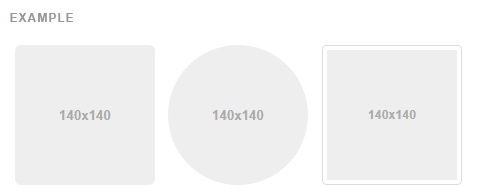

## Images

#### Responsive images

Images in Bootstrap 3 can be made responsive-friendly via the addition of the `.img-responsive` class. This applies `max-width: 100%;`, `height: auto;` and `display: block;` to the image so that it scales nicely to the parent element.

To center images which use the `.img-responsive` class, use `.center-block` instead of `.text-center`. [See the helper classes section](http://getbootstrap.com/css/#helper-classes-center)for more details about `.center-block` usage.

```

```

#### Image shapes



```


```


## Typography


